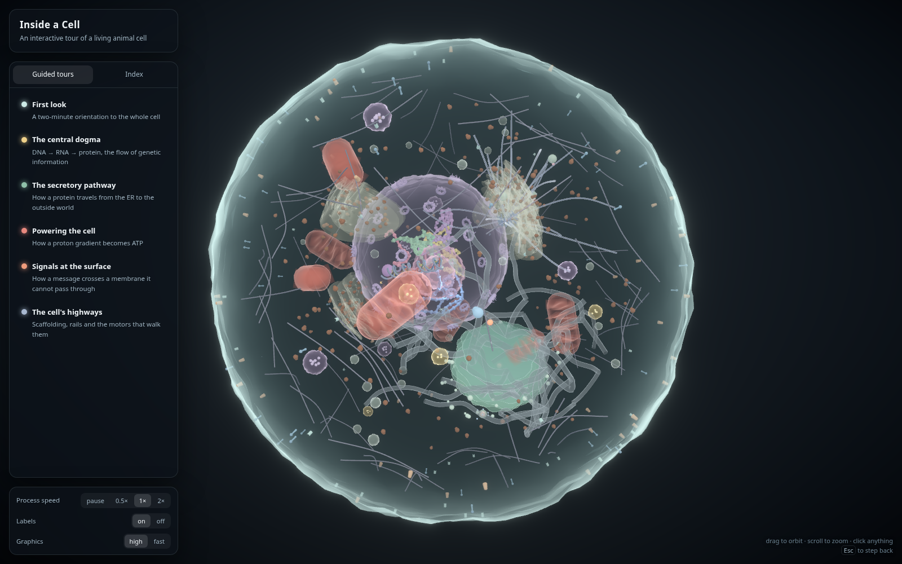

# Inside a Cell

An interactive 3D animal cell — anatomy you can fly through and five biological
processes running continuously inside it. Built with Three.js (via React Three
Fiber) and deployable as a static site.



## Running it

```bash
npm install
npm run dev      # http://localhost:5178
npm run build    # type-checks, then emits dist/
npm run preview  # serve the production build locally
```

## Deploying to Vercel

The app is a static SPA — no server, no environment variables.

```bash
npx vercel        # preview deployment
npx vercel --prod # production
```

`vercel.json` already pins the framework (`vite`), build command and output
directory, so importing the repo through the Vercel dashboard works with no
configuration either.

## What is in the scene

**Structures** — plasma membrane and its embedded receptors, channels and pumps;
cytosol; nucleus with a double envelope, nuclear pore complexes and a nucleolus;
chromatin territories with nucleosome beads; rough and smooth ER; free and
membrane-bound ribosomes; Golgi stack; transport vesicles; mitochondria with
cristae; lysosomes; peroxisomes; microtubules; cortical actin; centrosome.

**Processes**, all animated and all running at once:

| Process | What it shows |
| --- | --- |
| Central dogma | Transcription with a moving bubble, mRNA export through a pore, translation with tRNA delivery, folding |
| Secretory pathway | COPII budding from the ER, transit and glycosylation through the Golgi, exocytosis |
| Bioenergetics | Proton pumping at the electron transport chain, the gradient, a rotating ATP synthase, ATP release |
| Signalling | Ligand binding, receptor shape change, cascade amplification, clathrin-mediated endocytosis |
| Trafficking | Microtubule dynamic instability, motor proteins walking cargo along them |

## Interaction

- **Drag** to orbit, **scroll** to zoom, **click** any structure for an explanation.
- **Guided tours** fly the camera through a process step by step; arrow keys step,
  space pauses, `Esc` backs out.
- **Process speed** freezes or accelerates the biology without freezing the camera.
- **Graphics: fast** drops the bloom pass on weaker hardware.

## How it is put together

```
src/
  data/layout.ts      every organelle position, generated once from a fixed seed
  data/content.ts     explanations and tour scripts
  lib/                geometry generators, simplex noise, the membrane shader
  scene/organelles/   one component per structure
  scene/mechanisms/   one component per animated process
  state/store.ts      selection, tours, camera goals
  ui/                 overlay panels
```

Two things are worth knowing before editing:

- **The layout is seeded.** `data/layout.ts` generates positions deterministically
  so tours can fly to hard-coded coordinates. Changing a seed moves everything.
- **One clock drives the biology.** `scene/clock.ts` accumulates time scaled by the
  speed control; mechanisms read it rather than the render clock, so changing
  speed never makes an animation jump mid-cycle.

## Looking at changes

```bash
npm run shot -- overview                 # writes shots/overview.png
npm run shot -- probe tools/probe.js     # + triangle/draw-call census
npm run soak                             # exception sweep, run after scene changes
```

`tools/shoot.mjs` can run a script in the page before capturing — `tools/hero.js`
is the one that produces the image at the top of this file. Drive `window.__store`
directly rather than clicking DOM buttons; dev builds expose it on `window` from
`scene/DevBridge.tsx`, along with `__scene`, `__camera`, `__gl` and `__fps`.

Note the harness runs headless Chromium on SwiftShader, so it renders at 1–2 fps
and bloom and antialiasing do not look the way they will on a GPU. Use it for
exception sweeps and geometry censuses; judge the look in a real browser.

## Traps that are already fixed

These cost real time to find. Each is commented at its site, but all of them are
easy to undo by accident.

1. **`IcosahedronGeometry`'s `detail` is a linear subdivision count, not a
   recursion depth.** Each of the 20 faces becomes `(detail + 1)²` triangles, so
   detail 5 is 720 triangles, not 20,000. Membranes need detail ~20–30.
2. **It is non-indexed with per-face normals**, so `computeVertexNormals()`
   gives flat shading. `mergeVertices` does not rescue it either — it dedupes on
   *all* attributes, and even after dropping `uv`/`normal` about 1% of
   coincident vertices land either side of its position-hash bucket boundary and
   never merge, speckling the surface with creases. `blobGeometry` writes
   normals analytically (normalised position, valid because the blob is
   star-shaped). Do not replace that with `computeVertexNormals()`.
3. **`DoubleSide` + `depthWrite: false` on a closed shell** makes every triangle
   blend against its own back face in arbitrary order, which looks like
   faceting. Closed shells use `FrontSide` (with a `BackSide` companion where an
   inner surface is wanted); `DoubleSide` is only for genuinely open sheets.
4. **Zustand selectors must return stable references.** `useHighlightSet` builds
   its `Set` in a `useMemo`, not in the selector — returning a fresh object from
   a selector reports a change on every render and spins into an infinite loop.
5. **Camera flights are wall-clock timed**, not driven by accumulated frame
   deltas (`scene/CameraRig.tsx`). Delta-driven flights crawl on slow hardware.
   The biological clock in `scene/clock.ts` is the opposite by design — it *is*
   delta-driven and clamped, so the biology slows down rather than jumping when
   frames are dropped.
6. **Depth haze must sink towards the background colour, not towards grey.**
   Desaturating a fragment towards its own luminance preserves its brightness, so
   on a dark scene the distant shells go milky and come *forward*. The mix in the
   membrane fragment shader is weighted heavily towards `FOG.color` for exactly
   this reason.
7. **`InstancedMesh` per-instance colours tint diffuse only, never emissive.**
   Any emissive on such a material is the same colour on every instance and
   flattens the whole set towards it. This is what was hiding the DNA base
   colours, and the same shape of bug is available anywhere `setColorAt` meets a
   material with `emissiveIntensity > 0`.
8. **A halo shell displaced by the same noise as the shell beneath it will own
   the silhouette.** The plasma membrane used to carry a glycocalyx shell at
   1.03x the radius; its outline sat outside the real one, so the cell read as
   crumpled foil. Related: compensating for a lost halo by raising the rim is a
   trap of its own — a broad, low-power fresnel spreads glow across the whole
   disc and veils everything behind it. Tight rim, faint face.

## Accuracy

Shapes, proportions, topology and sequence of events follow the real biology.
Two deliberate departures: the smallest structures (nuclear pores, membrane
proteins, ribosomes) are drawn larger than scale so they are visible at all, and
colour is a labelling device — a real cell is essentially transparent.
